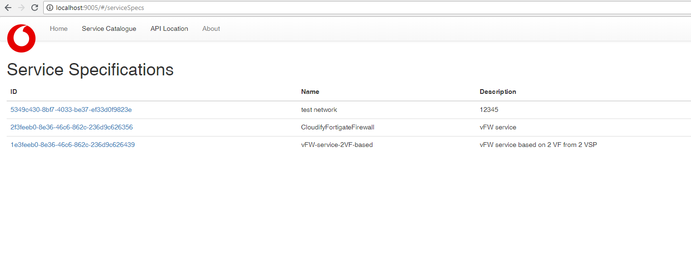
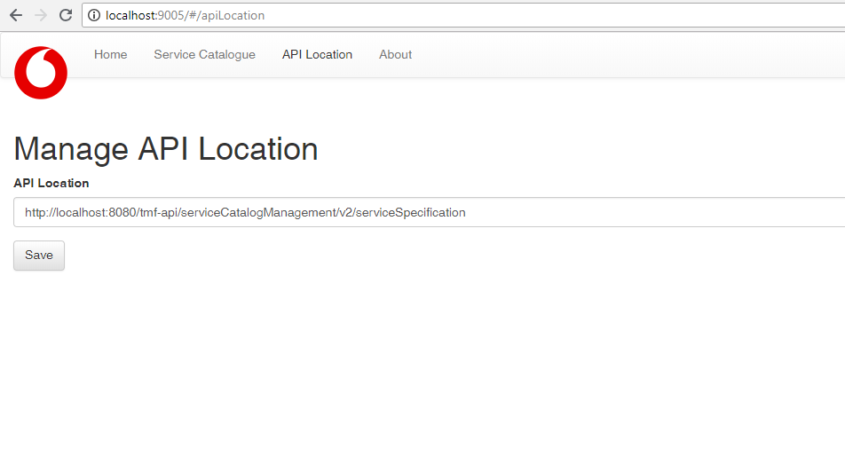

# ServiceManagementUI

This application allows you to view the Service Catalog, place Service Orders (TBD) and view the Service Inventory(TBD). It sits on top of the TM Forum Open-APIs for Service Catalogue, Service Order and Service Inventory. See:

* [TMF633_ServiceCatalog](https://github.com/tmforum-apis/TMF633_ServiceCatalog)
* [TMF641_ServiceOrder](https://github.com/tmforum-apis/TMF641_ServiceOrder)
* [TMF641_ServiceOrder](https://github.com/tmforum-apis/TMF638_ServiceInventory)

The application is a simple viewer for demonstration purposes only.

The applicaiton allows you to view and drill-down into any Service Catalog:

You can point the UI to any API Location:

# Run

To run:

1. install node and gulp
2. type `npm install` to install required dependancies.
3. type `gulp` to run server.

# Architecture

The application is built using react, react-router and flux javascript frameworks.
